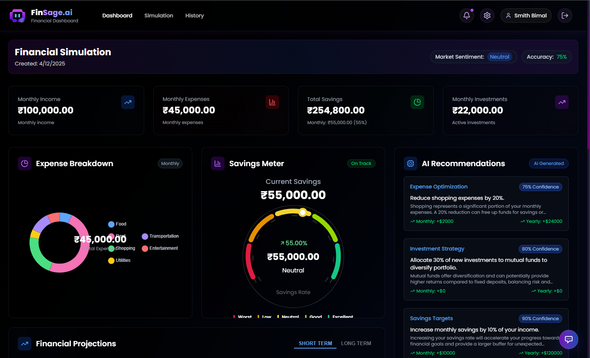

# FinSage.ai (Financial Intelligence)

## Introduction

**FinSage.ai** is a next-gen financial intelligence platform that empowers users to make informed, data-driven decisions about their financial future. Built with modern technologies and a focus on user-centric design, it enables simulations of life decisions, provides personalized AI-based recommendations, and maintains a privacy-first model. Whether you're planning a career change or managing expenses, FinSage.ai helps you visualize the financial impact of your choices in real time.

## Project Type

**Full Stack Project**

A complete MERN-based solution that integrates intelligent decision-making with beautiful frontend visuals and responsive user experience.

## Deployed App

[👉 Frontend - https://finsage-ai-phi.vercel.app](https://finsage-ai-phi.vercel.app/)
[👉 Backend - https://finsage-ai.onrender.com](https://finsage-ai.onrender.com)

## Video Walkthrough

🎥 [Watch the Project Demo](https://your-google-drive-link)

## Directory Structure

```
xto10x-3/
├─ client/
│ ├─ public/
│ ├─ src/
│ │ ├─ assets/
│ │ ├─ components/
│ │ │ ├─ dashboard/
│ │ │ └─ history
│ │ ├─ config/
│ │ ├─ contexts/
│ │ ├─ hooks/
│ │ ├─ pages/
│ │ ├─ services/
│ │ ├─ styles/
├─ server/
│ ├─ config/
│ ├─ controllers/
│ ├─ helpers/
│ ├─ middlewares/
│ ├─ models/
│ │ ├─ schemas/
│ ├─ routes/
│ ├─ services/
│ │ ├─ AI/
│ │ │ ├─ handlers/
│ │ ├─ simulation/
│ ├─ utils/
```

## Glimpse and Screenshots of our Cloned Website:
Landing Page


Auth page


Dashboard Page


History page


## Features

- 🔮 **"What If" Financial Simulations** – Visualize different outcomes from major life and financial decisions.
- 🤖 **AI-Powered Advisor** – Real-time financial tips generated using Google's Generative AI.
- 📊 **Interactive Dashboards** – Dynamic graphs and analytics for financial insights.
- 🔐 **Privacy-Centric Design** – No third-party sharing of financial data.
- 🧭 **Backward Analysis** – Track past decisions and their financial consequences.
- 📱 **Responsive UI** – Mobile-friendly, accessible, and intuitive layout.

## Technologies Used

### Core Stack:

- **MongoDB, Express.js, React.js, Node.js, GenAI, JWT, React charts** (MERN Stack)

### Frontend:

- **React** – Component-based UI framework
- **React Router** – Client-side routing
- **Tailwind CSS** – Utility-first CSS framework
- **Framer Motion** – Smooth animations and transitions
- **Heroicons** – Beautifully crafted SVG icons
- **Lucide Icons** – Open-source icon library
- **Animate.css (Tailwind plugin)** – Predefined animation classes
- **Tailwind Merge** – Class merging utility for Tailwind
- **Chart.js** & **React Chart.js 2** – Data visualization and charting

### Backend & APIs:

- **Node.js** – Server runtime
- **Express.js** – Web framework
- **MongoDB with Mongoose** – NoSQL database with schema modeling
- **Axios** – API communication

### AI & Integrations:

- **Google Generative AI API** – Personalized financial recommendations powered by generative AI

### Dev Tools & Deployment:

- **Git & GitHub** – Version control
- **Vercel** – Frontend hosting and continuous deployment
- **Render** – Backend hosting and continuous deployment
- **Vite** – Fast development bundler and build tool

## Design Decisions & Assumptions

- Opted for a professional **purple-themed UI** to reflect innovation and trust.
- Kept UX minimal and intuitive for users with varying levels of financial knowledge.
- Modular design approach for easy scaling and feature updates.
- Prioritized **data security and privacy** in every feature.
- Focused on mobile-first responsiveness and performance optimization.

## Installation & Getting Started

### Prerequisites

Ensure the following tools are installed:

- Node.js (v14+)
- npm or Yarn
- Git
- MongoDB or MongoDB Atlas

### Installation Steps

#### 1. Clone the Repository

```bash
git clone https://github.com/your-username/finsage-ai.git
cd finsage-ai
    a. Install Frontend Dependencies
        cd client
        npm install
        npm run dev
    b. Install Backend Dependencies
        cd server
        npm install
        npm start
Fire up the local host for both

## Contributors
___________________________________________________________________________
| Name           | GitHub                                                  |   
|--------------------------------------------------------------------------|
| Smith Bimal     | [@smith-bimal](https://github.com.smith-bimal)         |
| Raj Ghosh       | [@Rajghosh786](https://github.com/Rajghosh786)         |
| Ankith Mandal   | [@ankithmandal09](https://github.com/ankithmandal09)   |
___________________________________________________________________________

